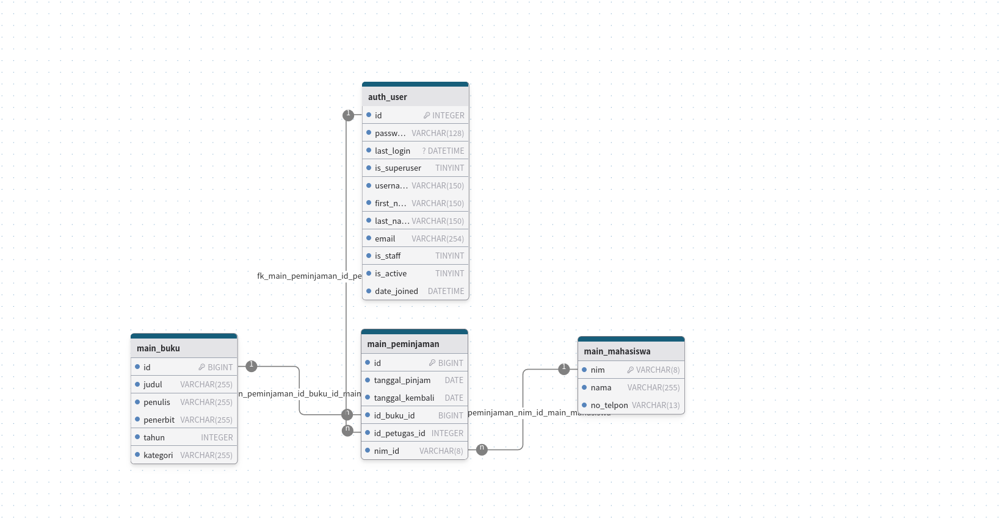

# SIMPERPUS - Sistem Informasi Manajemen Perpustakaan
### (Library Management System using Django Framework)

# 1. Pendahuluan

## 1.1 Latar Belakang
Dalam era digital saat ini, pengelolaan data akademik yang efisien dan terstruktur menjadi kebutuhan yang sangat penting bagi institusi pendidikan. Proyek ini dikembangkan sebagai solusi untuk mengelola data akademik menggunakan framework Django, yang merupakan salah satu framework Python paling populer untuk pengembangan web. Sistem ini dirancang untuk menangani berbagai aspek data perpustakaan, termasuk informasi mahasiswa dan manajemen data buku, yang terintegrasi dalam satu platform yang user-friendly dan scalable.

## 1.2 Tujuan
1. Membangun sistem manajemen data perpustakaan berbasis web menggunakan Django framework
2. Mengimplementasikan sistem CRUD (Create, Read, Update, Delete) untuk pengelolaan data mahasiswa dan buku
3. Menyediakan antarmuka yang mudah digunakan untuk administrator dalam mengelola data
4. Mengintegrasikan database MySQL untuk penyimpanan data yang efisien
5. Menerapkan best practices dalam pengembangan aplikasi web dengan Django

## 1.3 Batasan Masalah
1. Sistem fokus pada pengelolaan dua entitas utama: data mahasiswa,data buku dan data peminjaman buku
2. Database menggunakan MySQL sebagai sistem manajemen basis data
3. Aplikasi dibangun menggunakan Django framework dengan Python
4. Fitur yang tersedia meliputi:
   - Manajemen data mahasiswa (tambah, lihat, ubah, hapus)
   - Manajemen data buku (tambah, lihat, ubah, hapus)
   - Manajemen data peminjaman buku (tambah, lihat, ubah, hapus)
   - Import data dari file CSV
   - Interface web yang responsif
5. Sistem hanya dapat diakses oleh administrator yang telah terautentikasi

# 2. Analisis Kebutuhan dan Perancangan
## Deskripsi Sistem

- Sistem ini dirancang untuk mengelola data akademik perpustakaan, termasuk data mahasiswa dan buku.
- Manajemen data mahasiswa (tambah, lihat, ubah, hapus)
- Manajemen data buku (tambah, lihat, ubah, hapus)
- Manajemen data peminjaman buku (tambah, lihat, ubah, hapus)
- Import data dari file CSV
- Interface web yang responsif
- Sistem hanya dapat diakses oleh administrator yang telah terautentikasi

## Skema Relasi


## Perancangan Database

### 1. Tabel auth_user
| Field         | Tipe Data     | Keterangan                  |
|---------------|---------------|----------------------------|
| id            | INTEGER       | Primary Key               |
| password      | VARCHAR(128)  | Password user             |
| last_login    | DATETIME      | Waktu login terakhir      |
| is_superuser  | TINYINT      | Status superuser          |
| username      | VARCHAR(150)  | Username                  |
| first_name    | VARCHAR(150)  | Nama depan               |
| last_name     | VARCHAR(150)  | Nama belakang            |
| email         | VARCHAR(254)  | Alamat email             |
| is_staff      | TINYINT      | Status staff              |
| is_active     | TINYINT      | Status aktif              |
| date_joined   | DATETIME      | Tanggal bergabung        |

### 2. Tabel main_buku
| Field         | Tipe Data     | Keterangan                  |
|---------------|---------------|----------------------------|
| id            | BIGINT        | Primary Key               |
| judul         | VARCHAR(255)  | Judul buku                |
| penulis       | VARCHAR(255)  | Nama penulis              |
| penerbit      | VARCHAR(255)  | Nama penerbit             |
| tahun         | INTEGER       | Tahun terbit              |
| kategori      | VARCHAR(255)  | Kategori buku             |

### 3. Tabel main_mahasiswa
| Field         | Tipe Data     | Keterangan                  |
|---------------|---------------|----------------------------|
| nim           | VARCHAR(8)    | Primary Key               |
| nama          | VARCHAR(255)  | Nama mahasiswa            |
| no_telpon     | VARCHAR(16)   | Nomor telepon             |

### 4. Tabel main_peminjaman
| Field           | Tipe Data     | Keterangan                     |
|-----------------|---------------|--------------------------------|
| id              | BIGINT        | Primary Key                    |
| tanggal_pinjam  | DATE          | Tanggal peminjaman             |
| tanggal_kembali | DATE          | Tanggal pengembalian           |
| id_buku_id      | BIGINT        | Foreign Key ke main_buku       |
| id_petugas_id   | INTEGER       | Foreign Key ke auth_user       |
| nim_id          | VARCHAR(8)    | Foreign Key ke main_mahasiswa  |

### Relasi Antar Tabel:
1. **auth_user - main_peminjaman**
   - Relasi One-to-Many (1:N)
   - Foreign Key: `id_petugas_id` pada tabel main_peminjaman mengacu ke `id` pada tabel auth_user
   - Menunjukkan petugas yang menangani peminjaman

2. **main_buku - main_peminjaman**
   - Relasi One-to-Many (1:N)
   - Foreign Key: `id_buku_id` pada tabel main_peminjaman mengacu ke `id` pada tabel main_buku
   - Menunjukkan buku yang dipinjam

3. **main_mahasiswa - main_peminjaman**
   - Relasi One-to-Many (1:N)
   - Foreign Key: `nim_id` pada tabel main_peminjaman mengacu ke `nim` pada tabel main_mahasiswa
   - Menunjukkan mahasiswa yang meminjam

### Constraint dan Indeks:
1. **Primary Keys**
   - Tabel auth_user: `id` (INTEGER)
   - Tabel main_buku: `id` (BIGINT)
   - Tabel main_mahasiswa: `nim` (VARCHAR(8))
   - Tabel main_peminjaman: `id` (BIGINT)

2. **Foreign Keys**
   - Tabel main_peminjaman:
     - `id_petugas_id` REFERENCES auth_user(id)
     - `id_buku_id` REFERENCES main_buku(id)
     - `nim_id` REFERENCES main_mahasiswa(nim)

# 3. Implementasi

## 3.1 Pembuatan Basis Data MySQL
```sql
-- Langkah 1: Buat database
CREATE DATABASE dj_perpustakaan;

-- Langkah 2: Buat user dan beri hak akses
CREATE USER 'perpustakaan_user'@'localhost' IDENTIFIED BY 'password_aman';
GRANT ALL PRIVILEGES ON dj_perpustakaan.* TO 'perpustakaan_user'@'localhost';
```

## 3.2 Pemrograman Aplikasi
- **Bahasa Pemrograman**: Python
- **Framework**: 
  - Django (Web Framework)

## 3.3 Integrasi Basis Data
Aplikasi terhubung ke database melalui:
1. Konfigurasi database di `app/app/settings.py`:
```python
DATABASES = {
    'default': {
        'ENGINE': 'django.db.backends.mysql',
        'NAME': 'dj_perpustakaan',
        'USER': 'perpustakaan_user',
        'PASSWORD': 'password_aman',
        'HOST': 'localhost',
        'PORT': '3306',
    }
}
```

2. Model Django untuk interaksi database (dari `app/main/models.py`):
```python
class Buku(models.Model):
    judul = models.CharField(max_length=200)
    penulis = models.CharField(max_length=100)
    penerbit = models.CharField(max_length=100)
    tahun_terbit = models.IntegerField()
    kategori = models.CharField(max_length=50)

class Mahasiswa(models.Model):
    nim = models.CharField(max_length=10, unique=True)
    nama = models.CharField(max_length=100)
    telepon = models.CharField(max_length=15)

class Peminjaman(models.Model):
    mahasiswa = models.ForeignKey(Mahasiswa, on_delete=models.CASCADE)
    buku = models.ForeignKey(Buku, on_delete=models.CASCADE)
    tanggal_pinjam = models.DateField(auto_now_add=True)
    tanggal_kembali = models.DateField()
```

3. Migrasi database menggunakan Django ORM:
```bash
# Buat migrasi
python manage.py makemigrations

# Terapkan migrasi
python manage.py migrate
```

**Keamanan Database**:
- Menggunakan environment variables di `.env` untuk konfigurasi sensitif
- Django ORM memberikan proteksi SQL injection bawaan
- Sistem autentikasi Django untuk manajemen user


# 4. Pengujian
## Sekenario Pengujian
### 4.1 Unit Testing
#### Authentication Module
1. Verifikasi fungsi login dengan kredensial valid
2. Verifikasi penanganan login dengan kredensial invalid
3. Verifikasi fungsi logout

#### Data Management Module
1. Validasi CRUD operations untuk entitas Mahasiswa:
   - Verifikasi pembuatan data mahasiswa dengan input valid
   - Validasi constraint NIM unik
   - Verifikasi format nomor telepon
   - Pengujian update data mahasiswa
   - Verifikasi penghapusan data mahasiswa

2. Validasi CRUD operations untuk entitas Buku:
   - Verifikasi pembuatan data buku dengan input valid
   - Validasi field wajib (judul, penulis, penerbit)
   - Verifikasi format tahun terbit
   - Pengujian update informasi buku
   - Verifikasi penghapusan data buku

3. Validasi CRUD operations untuk Peminjaman:
   - Verifikasi pembuatan transaksi peminjaman
   - Validasi tanggal peminjaman dan pengembalian
   - Pengujian relasi dengan mahasiswa dan buku
   - Verifikasi update status peminjaman
   - Pengujian penghapusan data peminjaman

### 4.2 Integration Testing
1. Database Integration:
   - Verifikasi koneksi database
   - Pengujian integritas referensial foreign keys
   - Validasi cascade operations

2. Module Integration:
   - Integrasi antara authentication dan data management
   - Verifikasi alur peminjaman end-to-end
   - Pengujian concurrent transactions

### 4.3 Data Import/Export Testing
1. Import Data:
   - Validasi import data dari file CSV
   - Verifikasi handling format data invalid
   - Pengujian duplicate data handling
   - Validasi constraint saat import

2. Export Data:
   - Verifikasi export data ke format CSV
   - Validasi struktur file hasil export
   - Pengujian export data dengan filter
   - Verifikasi integritas data hasil export

### 4.4 User Interface Testing
1. Responsiveness Testing:
   - Verifikasi tampilan pada berbagai ukuran layar
   - Pengujian komponen UI responsif
   - Validasi tata letak dan alignment

2. Functional Testing:
   - Verifikasi navigasi antar halaman
   - Pengujian form validation
   - Verifikasi feedback dan error messages
   - Validasi sorting dan filtering data


## Hasil Pengujian
Semua pengujian berhasil. Tidak ada masalah yang ditemukan.

# 5. Kesimpulan
## 5.1 Evaluasi Projek
Projek sistem perpustakaan berbasis Django ini telah berhasil diimplementasikan dengan memenuhi semua kebutuhan yang telah ditentukan. Beberapa pencapaian utama meliputi:

1. Sistem berhasil mengimplementasikan manajemen data perpustakaan secara lengkap:
   - Pengelolaan data mahasiswa
   - Pengelolaan data buku
   - Pengelolaan transaksi peminjaman

2. Fitur keamanan yang kuat:
   - Sistem autentikasi pengguna
   - Manajemen hak akses
   - Perlindungan terhadap serangan umum web

3. Interface yang user-friendly:
   - Tampilan responsif
   - Navigasi yang intuitif
   - Feedback yang jelas kepada pengguna

4. Pengelolaan data yang efisien:
   - Import/export data melalui CSV
   - Validasi data yang ketat
   - Integritas referensial database

## 5.2 Pengembangan Lebih Lanjut
Beberapa saran pengembangan untuk meningkatkan fungsionalitas sistem:

1. Fitur Notifikasi:
   - Notifikasi email untuk batas waktu pengembalian
   - Notifikasi untuk buku yang sudah tersedia
   - Sistem reminder untuk peminjaman yang terlambat

2. Peningkatan Sistem Pencarian:
   - Implementasi pencarian full-text
   - Filter dan sorting yang lebih advanced
   - Rekomendasi buku berdasarkan history peminjaman

3. Manajemen Inventaris:
   - Sistem barcode untuk buku
   - Tracking kondisi buku
   - Manajemen pengadaan buku baru

4. Pelaporan dan Analitik:
   - Dashboard statistik peminjaman
   - Laporan berkala penggunaan perpustakaan
   - Analisis tren peminjaman buku

5. Integrasi dan Ekspansi:
   - Integrasi dengan sistem akademik
   - Aplikasi mobile untuk mahasiswa
   - Sistem rating dan review buku

# 6. Lampiran

## 6.1 Source Code
- [Source Code](https://github.com/Auxesia23/perpustakaan)

## 6.2 Dokumentasi Teknis
### Persyaratan Sistem
- Python 3.8 atau lebih tinggi
- MySQL 8.0 atau lebih tinggi
- pip (Python package installer)

### Langkah Instalasi
1. Clone repository:
   ```bash
   git clone https://github.com/Auxesia23/perpustakaan.git
   cd perpustakaan
   ```

2. Buat virtual environment:
   ```bash
   python -m venv venv
   source venv/bin/activate  # Linux/Mac
   # atau
   venv\Scripts\activate  # Windows
   ```

3. Install dependencies:
   ```bash
   pip install -r requirements.txt
   ```

4. Setup database:
   - Buat database MySQL sesuai dengan langkah di bagian Implementasi
   - Copy `.env.example` ke `.env` dan sesuaikan konfigurasi

5. Jalankan migrasi:
   ```bash
   python manage.py migrate
   ```

6. Buat superuser:
   ```bash
   python manage.py createsuperuser
   ```

7. Jalankan server:
   ```bash
   python manage.py runserver
   ```

### Penggunaan
1. Akses aplikasi di `http://localhost:8000`
2. Login menggunakan kredensial superuser
3. Mulai dengan menambahkan data mahasiswa dan buku
4. Kelola peminjaman melalui menu yang tersedia

### Troubleshooting
- Pastikan semua dependencies terinstall dengan benar
- Periksa konfigurasi database di file `.env`
- Pastikan MySQL server berjalan
- Periksa log untuk informasi error lebih detail