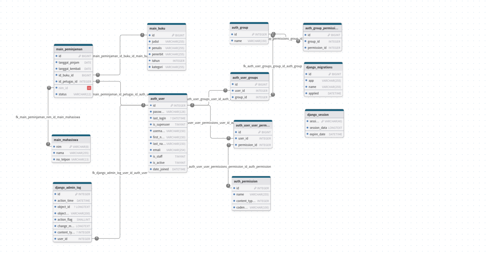

# 1. Pendahuluan

## 1.1 Latar Belakang
Dalam era digital saat ini, pengelolaan data akademik yang efisien dan terstruktur menjadi kebutuhan yang sangat penting bagi institusi pendidikan. Proyek ini dikembangkan sebagai solusi untuk mengelola data akademik menggunakan framework Django, yang merupakan salah satu framework Python paling populer untuk pengembangan web. Sistem ini dirancang untuk menangani berbagai aspek data perpustakaan, termasuk informasi mahasiswa dan manajemen data buku, yang terintegrasi dalam satu platform yang user-friendly dan scalable.

## 1.2 Tujuan
1. Membangun sistem manajemen data perpustakaan berbasis web menggunakan Django framework
2. Mengimplementasikan sistem CRUD (Create, Read, Update, Delete) untuk pengelolaan data mahasiswa dan buku
3. Menyediakan antarmuka yang mudah digunakan untuk administrator dalam mengelola data
4. Mengintegrasikan database MySQL untuk penyimpanan data yang efisien
5. Menerapkan best practices dalam pengembangan aplikasi web dengan Django

## 1.3 Batasan Masalah
1. Sistem fokus pada pengelolaan dua entitas utama: data mahasiswa,data buku dan data peminjaman buku
2. Database menggunakan MySQL sebagai sistem manajemen basis data
3. Aplikasi dibangun menggunakan Django framework dengan Python
4. Fitur yang tersedia meliputi:
   - Manajemen data mahasiswa (tambah, lihat, ubah, hapus)
   - Manajemen data buku (tambah, lihat, ubah, hapus)
   - Manajemen data peminjaman buku (tambah, lihat, ubah, hapus)
   - Import data dari file CSV
   - Interface web yang responsif
5. Sistem hanya dapat diakses oleh administrator yang telah terautentikasi

# 2. Analisis Kebutuhan dan Perancangan
## Deskripsi Sistem

- Sistem ini dirancang untuk mengelola data akademik perpustakaan, termasuk data mahasiswa dan buku.
- Manajemen data mahasiswa (tambah, lihat, ubah, hapus)
- Manajemen data buku (tambah, lihat, ubah, hapus)
- Manajemen data peminjaman buku (tambah, lihat, ubah, hapus)
- Import data dari file CSV
- Interface web yang responsif
- Sistem hanya dapat diakses oleh administrator yang telah terautentikasi

## Skema Relasi


## Perancangan Database

### 1. Tabel auth_user
| Field         | Tipe Data     | Keterangan                  |
|---------------|---------------|----------------------------|
| id            | INTEGER       | Primary Key               |
| password      | VARCHAR(128)  | Password user             |
| last_login    | DATETIME      | Waktu login terakhir      |
| is_superuser  | TINYINT      | Status superuser          |
| username      | VARCHAR(150)  | Username                  |
| first_name    | VARCHAR(150)  | Nama depan               |
| last_name     | VARCHAR(150)  | Nama belakang            |
| email         | VARCHAR(254)  | Alamat email             |
| is_staff      | TINYINT      | Status staff              |
| is_active     | TINYINT      | Status aktif              |
| date_joined   | DATETIME      | Tanggal bergabung        |

### 2. Tabel main_buku
| Field         | Tipe Data     | Keterangan                  |
|---------------|---------------|----------------------------|
| id            | BIGINT        | Primary Key               |
| judul         | VARCHAR(255)  | Judul buku                |
| penulis       | VARCHAR(255)  | Nama penulis              |
| penerbit      | VARCHAR(255)  | Nama penerbit             |
| tahun         | INTEGER       | Tahun terbit              |
| kategori      | VARCHAR(255)  | Kategori buku             |

### 3. Tabel main_mahasiswa
| Field         | Tipe Data     | Keterangan                  |
|---------------|---------------|----------------------------|
| nim           | VARCHAR(8)    | Primary Key               |
| nama          | VARCHAR(255)  | Nama mahasiswa            |
| no_telpon     | VARCHAR(16)   | Nomor telepon             |

### 4. Tabel main_peminjaman
| Field           | Tipe Data     | Keterangan                     |
|-----------------|---------------|--------------------------------|
| id              | BIGINT        | Primary Key                    |
| tanggal_pinjam  | DATE          | Tanggal peminjaman             |
| tanggal_kembali | DATE          | Tanggal pengembalian           |
| id_buku_id      | BIGINT        | Foreign Key ke main_buku       |
| id_petugas_id   | INTEGER       | Foreign Key ke auth_user       |
| nim_id          | VARCHAR(8)    | Foreign Key ke main_mahasiswa  |

### Relasi Antar Tabel:
1. **auth_user - main_peminjaman**
   - Relasi One-to-Many (1:N)
   - Foreign Key: `id_petugas_id` pada tabel main_peminjaman mengacu ke `id` pada tabel auth_user
   - Menunjukkan petugas yang menangani peminjaman

2. **main_buku - main_peminjaman**
   - Relasi One-to-Many (1:N)
   - Foreign Key: `id_buku_id` pada tabel main_peminjaman mengacu ke `id` pada tabel main_buku
   - Menunjukkan buku yang dipinjam

3. **main_mahasiswa - main_peminjaman**
   - Relasi One-to-Many (1:N)
   - Foreign Key: `nim_id` pada tabel main_peminjaman mengacu ke `nim` pada tabel main_mahasiswa
   - Menunjukkan mahasiswa yang meminjam

### Constraint dan Indeks:
1. **Primary Keys**
   - Tabel auth_user: `id` (INTEGER)
   - Tabel main_buku: `id` (BIGINT)
   - Tabel main_mahasiswa: `nim` (VARCHAR(8))
   - Tabel main_peminjaman: `id` (BIGINT)

2. **Foreign Keys**
   - Tabel main_peminjaman:
     - `id_petugas_id` REFERENCES auth_user(id)
     - `id_buku_id` REFERENCES main_buku(id)
     - `nim_id` REFERENCES main_mahasiswa(nim)

# 3. Implementasi

## 3.1 Pembuatan Basis Data MySQL
```sql
-- Langkah 1: Buat database
CREATE DATABASE dj_perpustakaan;

-- Langkah 2: Buat user dan beri hak akses
CREATE USER 'perpustakaan_user'@'localhost' IDENTIFIED BY 'password_aman';
GRANT ALL PRIVILEGES ON dj_perpustakaan.* TO 'perpustakaan_user'@'localhost';
```

## 3.2 Pemrograman Aplikasi
- **Bahasa Pemrograman**: Python
- **Framework**: 
  - Django (Web Framework)

## 3.3 Integrasi Basis Data
Aplikasi terhubung ke database melalui:
1. Konfigurasi database di `app/app/settings.py`:
```python
DATABASES = {
    'default': {
        'ENGINE': 'django.db.backends.mysql',
        'NAME': 'dj_perpustakaan',
        'USER': 'perpustakaan_user',
        'PASSWORD': 'password_aman',
        'HOST': 'localhost',
        'PORT': '3306',
    }
}
```

2. Model Django untuk interaksi database (dari `app/main/models.py`):
```python
class Buku(models.Model):
    judul = models.CharField(max_length=200)
    penulis = models.CharField(max_length=100)
    penerbit = models.CharField(max_length=100)
    tahun_terbit = models.IntegerField()
    kategori = models.CharField(max_length=50)

class Mahasiswa(models.Model):
    nim = models.CharField(max_length=10, unique=True)
    nama = models.CharField(max_length=100)
    telepon = models.CharField(max_length=15)

class Peminjaman(models.Model):
    mahasiswa = models.ForeignKey(Mahasiswa, on_delete=models.CASCADE)
    buku = models.ForeignKey(Buku, on_delete=models.CASCADE)
    tanggal_pinjam = models.DateField(auto_now_add=True)
    tanggal_kembali = models.DateField()
```

3. Migrasi database menggunakan Django ORM:
```bash
# Buat migrasi
python manage.py makemigrations

# Terapkan migrasi
python manage.py migrate
```

**Keamanan Database**:
- Menggunakan environment variables di `.env` untuk konfigurasi sensitif
- Django ORM memberikan proteksi SQL injection bawaan
- Sistem autentikasi Django untuk manajemen user
